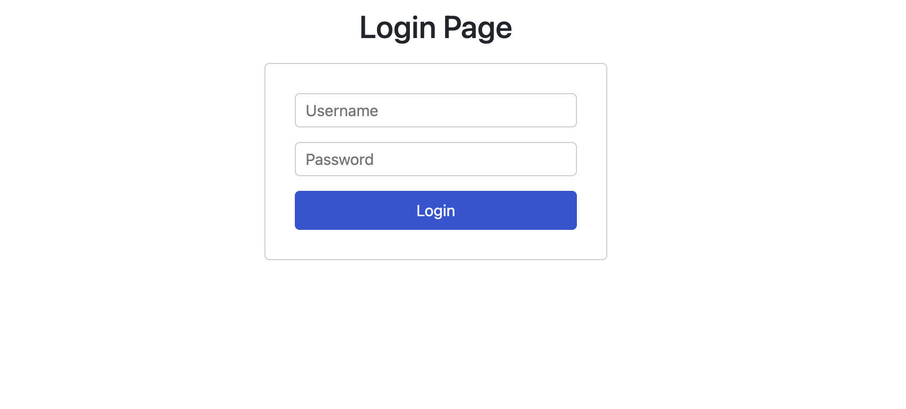
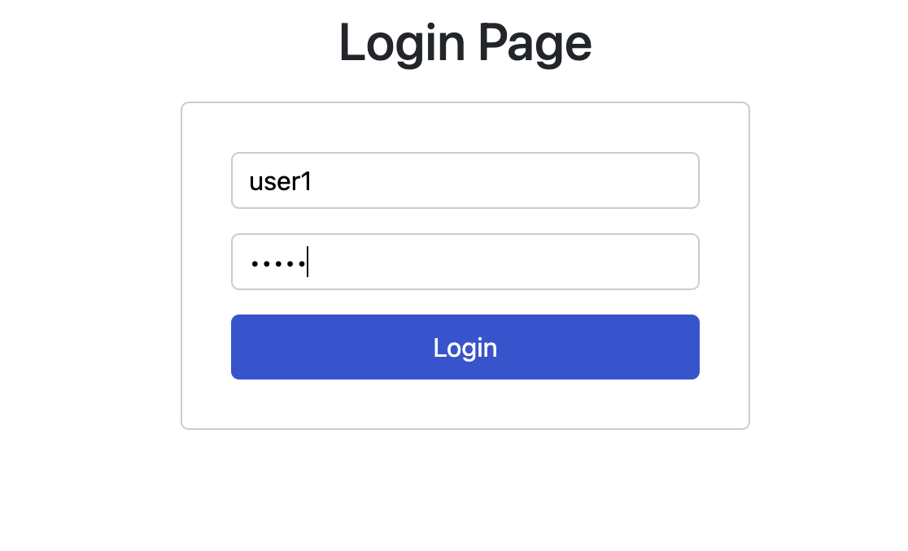

# Login Page using React

## Description

- The first screen of the application is the login screen. The user can enter the username and password and click on the login button to login to the application.
- On entering the username and password and clicking the `Login` button, the user is taken to the next screen which is the `Home` screen.
- The `Home` screen displays the username entered by the user.

## Screenshots

### Login Screen

### Home Screen

